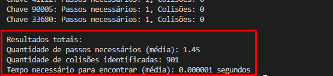

# Programa de Hash em C

Este programa em C demonstra o uso de uma tabela hash para armazenar e buscar chaves aleatórias geradas. Ele lê um arquivo `numeros_aleatorios.txt` para obter chaves e as insere em uma tabela hash. Em seguida, lê o arquivo `checkin.txt` para buscar cada chave na tabela hash e exibe os resultados na tela.

## Compilação

Para compilar o programa, abra um terminal e navegue até o diretório onde o arquivo `hash_table.c` está localizado. Em seguida, use o seguinte comando:

```bash
gcc -o hash_table hash_table.c
```
Isso compilará o código-fonte `hash_table.c` e criará um executável chamado hash_table.

## Execução
Após compilar o programa, você pode executá-lo digitando o seguinte comando no terminal:

```bash
./hash_table
```

O programa gerará um arquivo `checkin.txt` com chaves aleatórias e exibirá na tela os resultados das buscas na tabela hash.

## Resultado 


